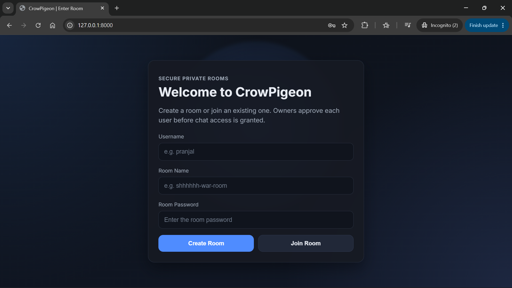
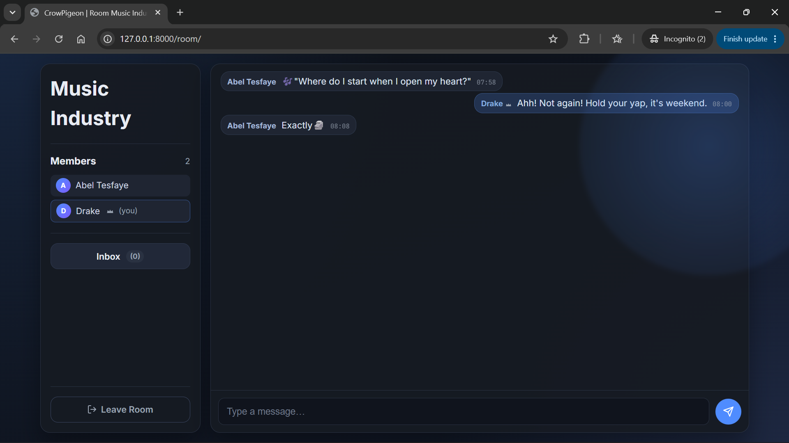
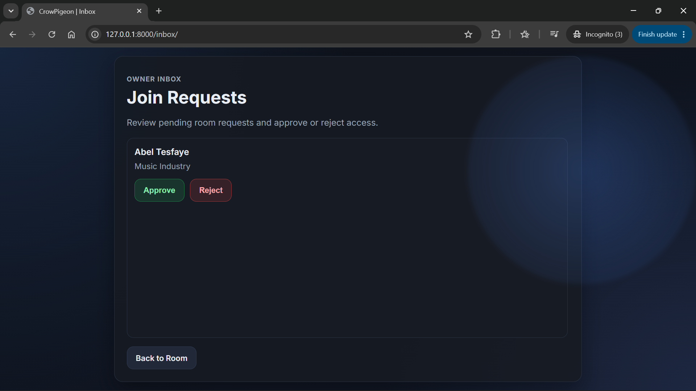
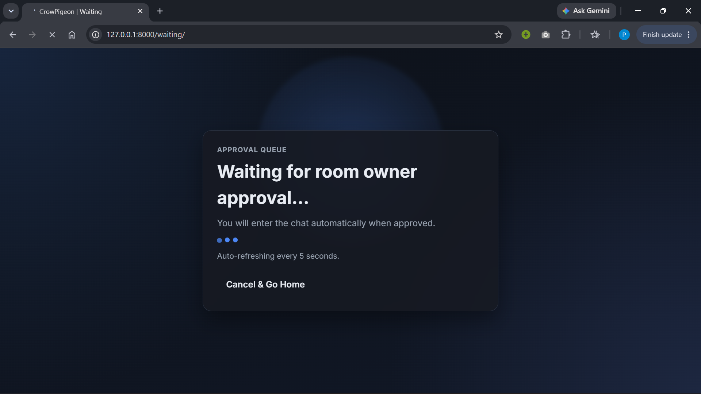

# CrowPigeon






---

A real-time chat application built with Django and [Django Channels](https://channels.readthedocs.io/). Users create password-protected rooms, and the room owner must approve every join request before a new member can see or send messages. Communication happens over [WebSockets](https://developer.mozilla.org/en-US/docs/Web/API/WebSockets_API), so messages appear instantly without page reloads.

There are no user accounts. Identity is tied to the browser session - pick a username, enter a room password, and you're in (once the owner says so). A lightweight Redis job queue handles background housekeeping like pruning old messages and cleaning up inactive rooms.

## Techniques

- **Session-based identity without Django auth** - users are identified by their [`session_key`](https://docs.djangoproject.com/en/5.2/topics/http/sessions/) rather than a `User` model. Room ownership, membership checks, and message authorship all key off the session.
- **Owner-gated admission** - joining a room puts you in a `pending` state. The room owner sees an inbox badge (updated in real-time via WebSocket) and can approve or reject each request. The [waiting page](templates/waiting.html) auto-refreshes with `<meta http-equiv="refresh">` until the status changes.
- **Async WebSocket consumer with ORM access** - [`ChatConsumer`](chat/consumers.py) is an `AsyncWebsocketConsumer` that wraps all database calls in [`database_sync_to_async`](https://channels.readthedocs.io/en/latest/topics/databases.html) to avoid blocking the event loop.
- **Real-time badge push** - when a new join request arrives, the view calls [`channel_layer.group_send`](https://channels.readthedocs.io/en/latest/topics/channel_layers.html) from synchronous Django code (via `async_to_sync`) to push the updated pending count to all connected room members.
- **Client-side XSS prevention** - incoming chat messages are escaped with a manual `escapeHtml` function before being injected into the DOM, covering `&`, `<`, `>`, `"`, and `'`.
- **CSS custom properties design system** - all colors, radii, and shadows are defined as [CSS custom properties](https://developer.mozilla.org/en-US/docs/Web/CSS/--*) in `:root`, making the dark theme easy to adjust or swap.
- **Responsive two-column layout** - the room view uses a [`grid-template-columns`](https://developer.mozilla.org/en-US/docs/Web/CSS/grid-template-columns) sidebar + chat panel layout that collapses to a single column below 980 px via a [`@media`](https://developer.mozilla.org/en-US/docs/Web/CSS/@media) query.
- **Decorator-based job registry** - [`redis_queue.py`](chat/redis_queue.py) uses a `@register_job` decorator pattern to map job names to handler functions, keeping task registration close to the task definition.
- **Frozen dataclass for job payloads** - jobs are represented as [`@dataclass(frozen=True)`](https://docs.python.org/3/library/dataclasses.html#frozen-instances) objects, making them immutable once created.
- **CSS `backdrop-filter` glassmorphism** - cards use [`backdrop-filter: blur()`](https://developer.mozilla.org/en-US/docs/Web/CSS/backdrop-filter) on a semi-transparent background to create a frosted-glass effect.
- **Keyframe micro-animations** - new chat messages fade in with a [`@keyframes`](https://developer.mozilla.org/en-US/docs/Web/CSS/@keyframes) slide-up animation, the inbox badge pulses on activity, and the waiting-page dots blink on a staggered delay.

## Technologies & Libraries

| Dependency | Role |
|---|---|
| [Python 3.12](https://www.python.org/) | Runtime environment |
| [Django 5.2](https://docs.djangoproject.com/en/5.2/) | Web framework, ORM, sessions, CSRF, password hashing |
| [Daphne](https://github.com/django/daphne) | Development ASGI server |
| [Django Channels 4.3](https://channels.readthedocs.io/) | WebSocket protocol support via ASGI |
| [channels-redis](https://github.com/django/channels_redis) | Redis channel layer backend for Django Channels |
| [Redis](https://redis.io/) (via [redis-py](https://github.com/redis/redis-py)) | Channel layer backend and custom job queue |
| [WhiteNoise](https://whitenoise.readthedocs.io/) | Serves static files directly from the ASGI app with compression |
| [psycopg (v3) / psycopg-binary](https://www.psycopg.org/psycopg3/) | Modern PostgreSQL adapter |
| [python-dotenv](https://github.com/theskumar/python-dotenv) | Loads `.env` variables into `os.environ` |
| [uvicorn](https://www.uvicorn.org/) | Production ASGI server |
| [websockets](https://github.com/python-websockets/websockets) | WebSocket protocol handler library for Uvicorn |

## Project Structure

```
CrowPigeon/
├── CrowPigeon/            # Django project settings & ASGI/WSGI entry points
├── chat/                  # Main application
│   ├── management/
│   │   └── commands/      # Custom manage.py commands (queue worker, housekeeping)
│   ├── migrations/
│   └── static/
│       └── chat/          # CSS and any future static assets
├── templates/             # Django templates (base, home, room, inbox, waiting)
├── screenshots/           # App screenshots & terminal logs (add your own)
├── manage.py
├── requirements.txt
└── .env                   # Environment config (not committed)
```

- [`chat/management/commands/`](chat/management/commands/) - contains `redis_queue_worker` (long-running job processor) and `enqueue_housekeeping_jobs` (one-shot command that queues cleanup tasks).
- [`templates/`](templates/) - uses Django template inheritance from a shared [`base.html`](templates/base.html). Each page gets its own backdrop orb variant and layout.
- [`chat/static/chat/`](chat/static/chat/) - single-file CSS design system (`maximal.css`) covering the full UI.

## Environment Variables

The app reads all config from environment variables (with sane defaults for local development). See [settings.py](CrowPigeon/settings.py) for the full list. Key variables:

| Variable | Purpose | Default |
|---|---|---|
| `DJANGO_SECRET_KEY` | Django secret key | `dev-only-insecure-key-change-me` |
| `DEBUG` | Enable debug mode | `False` |
| `DB_NAME`, `DB_USER`, `DB_PASSWORD`, `DB_HOST`, `DB_PORT` | PostgreSQL connection | `postgres` / `localhost:5432` |
| `CHANNEL_LAYER_BACKEND` | Set to `redis` to use Redis channel layer | in-memory |
| `REDIS_URL` | Redis connection string | `redis://127.0.0.1:6379/0` |

## License

MIT
